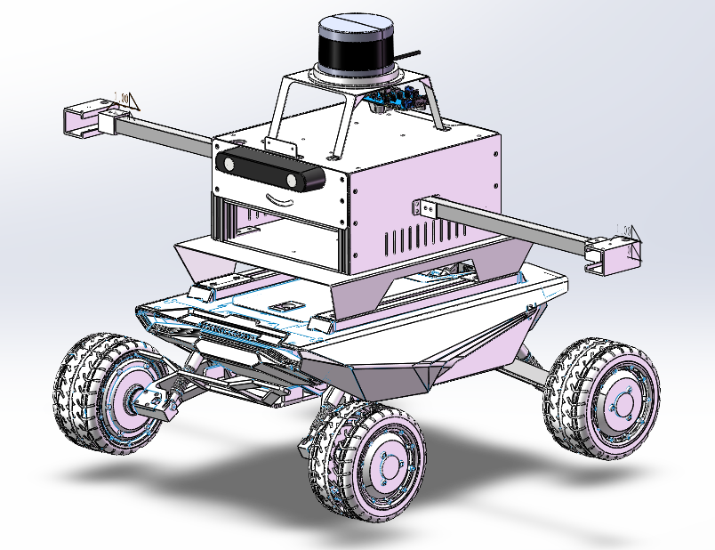

<ol>
  <li><b> Multi-sensor Information Fusion Localization and mapping 

  This project mainly uses inertial measurement unit (IMU), laser radar (LiDAR), and binocular camera (Stereo) as environment and motion sensors. Committed to applying it to autonomous exploration of unmanned systems in unknown environments.

  

  

  *<b>Datasheet</b>
  
  RTK <a href="../project/CHC® CGI-430厘米级组合导航系统用户手册-20230130.pdf" class="textlink" target="_blank">[pdf]</a>
  IMU <a href="../project/CH10X_um_cn.pdf" class="textlink" target="_blank">[pdf]</a>
  LiDAR <a href="../project/63-9243 REV D MANUAL,USERS,VLP-16.pdf" class="textlink" target="_blank">[pdf]</a>
  Camera <a href="../project/FLIR-BFLY-U3-23H.pdf" class="textlink" target="_blank">[pdf]</a>
  Synchronization Circuit <a href="../project/FLIR-BFLY-U3-23H.pdf" class="textlink" target="_blank">[pdf]</a>

  *<b>Code</b>
  
  （1）Multi-Sensors Calibration <a href="https://github.com/canyilu/tproduct" class="textlink" target="_blank">[Github]</a>
  
  （2）LiDAR-IMU SLAM <a href="https://github.com/canyilu/tproduct" class="textlink" target="_blank">[Github]</a>
  
  （3）Camera-IMU SLAM <a href="https://github.com/canyilu/tproduct" class="textlink" target="_blank">[Github]</a>
  
  （4）MultiSensors SLAM <a href="https://github.com/canyilu/tproduct" class="textlink" target="_blank">[Github]</a>
  
  （5）Dynamic Path Planning <a href="https://github.com/canyilu/tproduct" class="textlink" target="_blank">[Github]</a>

  （6）Hybrid Mapping <a href="https://github.com/canyilu/tproduct" class="textlink" target="_blank">[Github]</a>

  

